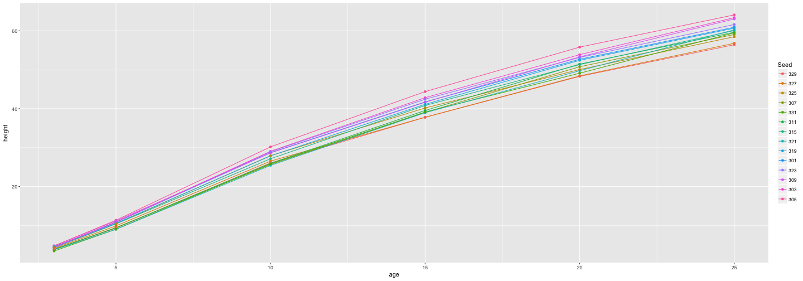

First Shiny App Pitch
========================================================
author: Carsten Rösnick-Neugebauer
date: April 8th, 2017
autosize: true

Motivation
========================================================

Let's create our first interactive Shiny app!


Planning: Steps to do
========================================================

- Find a suitable dataset
- Basic exploratory analysis
- Outline the Shiny app
- Build it!
- Share it with the course members

The dataset
========================================================

The Loblolly pine tree growth dataset was chosen:


```r
library(datasets)
data("Loblolly")
head(Loblolly)
```

```
   height age Seed
1    4.51   3  301
15  10.89   5  301
29  28.72  10  301
43  41.74  15  301
57  52.70  20  301
71  60.92  25  301
```

Resulting plot
========================================================

The center of the final Shiny app will be a plot of the following format:


```r
library(ggplot2)
library(datasets)
data("Loblolly") 
ggplot(data = Loblolly, aes(x = age, y = height, group = Seed, colour = Seed)) + geom_line() + geom_point()
```


