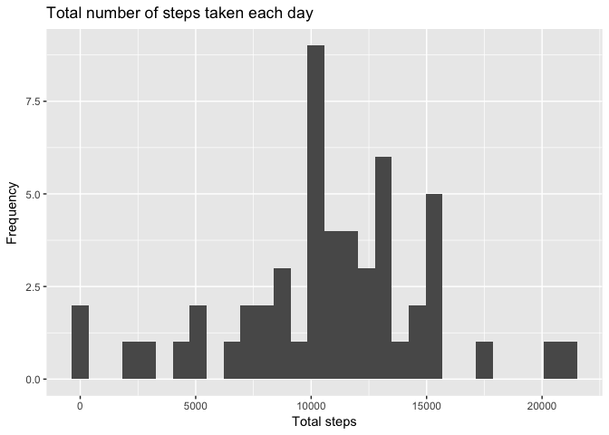
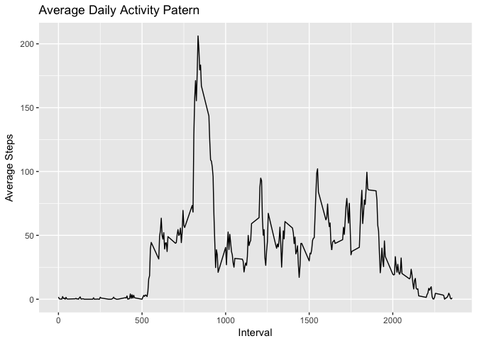
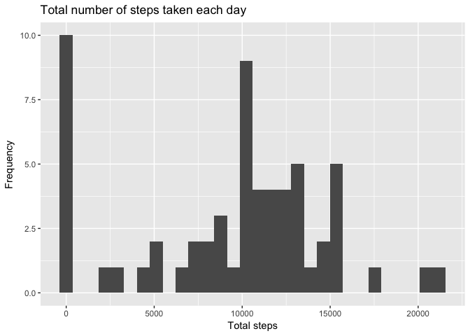
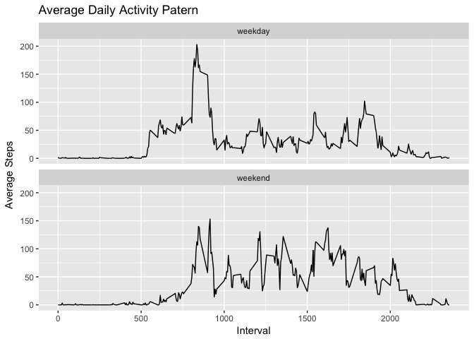

# Reproducible Research: Peer Assessment 1


```r
opts_chunk$set(messages = F, warning = F)
```

## Loading and preprocessing the data

Load some base packages we need for the analysis, and load the dataset as a table.
Notice that we keep the data as is, i.e., we don't perform any postprocessing at this point.


## What is mean total number of steps taken per day?

Group the data by date, summarize the steps within each group,
and plot a histogram of the frequency of these step totals.


```r
steps <- data %>% group_by(date) %>% summarize(steps_total = sum(steps))
steps.mean <- mean(steps$steps_total, na.rm = T)
steps.median <- median(steps$steps_total, na.rm = T)

ggplot(data = steps, aes(steps_total)) +
  geom_histogram() +
  labs(title = "Total number of steps taken each day",
       x = "Total steps",
       y = "Frequency")
```

```
## `stat_bin()` using `bins = 30`. Pick better value with `binwidth`.
```

<!-- -->

On average, 1.0766189\times 10^{4} steps are taken each day, while the median of steps is 10765.

## What is the average daily activity pattern?

We group the data by interval and compute the mean within each interval group.


```r
daily_activity <- data %>% group_by(interval) %>% summarize(average = mean(steps, na.rm = T))
ggplot(data = daily_activity, aes(interval, average)) +
  geom_line() +
  labs(title = "Average Daily Activity Patern",
       x = "Interval",
       y = "Average Steps")
```

<!-- -->

On average across all the days in the dataset, the 835th interval contains the maximum number of steps.

## Imputing missing values

The data contains a non-negligible amount of missing values.
How many there are _exactly_ is what we try to find out now:


```r
data.no_all <- nrow(data)
data.no_na <- nrow(data[is.na(data$steps),])
```

- Total number of rows: 17568
- Total number of rows with missing values: 2304

So the data we got contains 13.1% missing values.
As this is quite a lot, we _impute_ the data with the median of steps taken per day.


```r
data.imputed <- data
data.imputed$steps <- impute(data$steps, fun = median)
data.steps_by_date <- tapply(data.imputed$steps, data.imputed$date, sum)

data.steps_by_date.mean <- mean(data.steps_by_date)
data.steps_by_date.median <- median(data.steps_by_date)

qplot(data.steps_by_date,
      main = "Total number of steps taken each day",
      xlab = 'Total steps',
      ylab = 'Frequency')
```

```
## `stat_bin()` using `bins = 30`. Pick better value with `binwidth`.
```

<!-- -->

Let's compare the mean and median of the original data with those of the imputed data:


```r
data.frame(Original = c(steps.mean, steps.median),
           Imputed = c(data.steps_by_date.mean, data.steps_by_date.median),
           row.names = c("Mean", "Median"))
```

```
##        Original  Imputed
## Mean   10766.19  9354.23
## Median 10765.00 10395.00
```

What we observe is that there are numerous periods each day without any collected data.
Therefore the zero steps as the median defaults to zero in these cases.

## Are there differences in activity patterns between weekdays and weekends?

Given the imputed data, let's see how if the walking patterns differ between weekdays and weekends.


```r
data.wday <- data.imputed %>% mutate(day_type = as.factor(ifelse(is.weekend(as.Date(date)), "weekend", "weekday")))
data.wday.activity <- data.wday %>%
  group_by(interval, day_type) %>%
  mutate(average = mean(steps))
ggplot(data = data.wday.activity, aes(interval, average)) +
  geom_line() +
  facet_wrap(~day_type, ncol = 1) + 
  labs(title = "Average Daily Activity Patern",
       x = "Interval",
       y = "Average Steps")
```

<!-- -->
